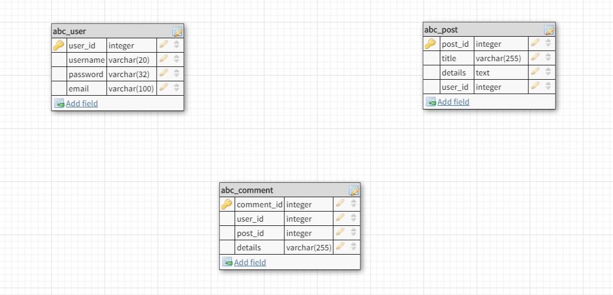
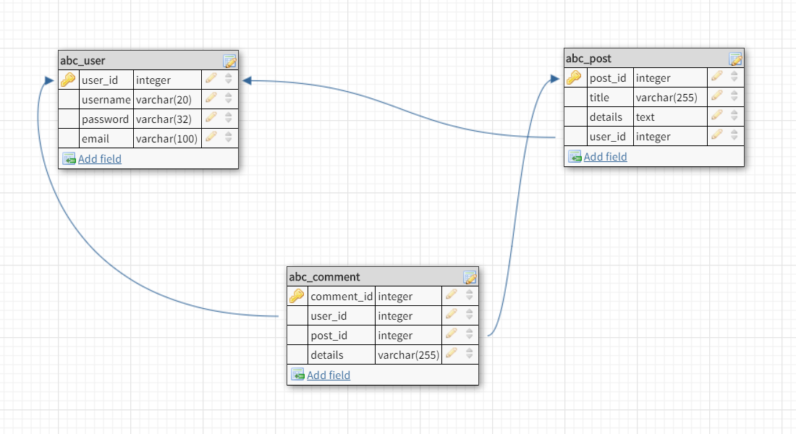

# ডাটাবেস ডিজাইন

**“ডাটাবেস ডিজাইন”** হচ্ছে এমন এক প্রক্রিয়া যেখানে একটি ডাটাবেসের ডাটার ধরন, ডাটার মধ্যবর্তী সম্পর্ক ইত্যাদি দিয়ে ডাটার মডেল প্রস্তুত করা হয়। এই ডাটার মডেল সাধারণত **“ডাটা ডেফিনেশন ল্যাঙ্গুয়েজ (DDL)”** এ কোড জেনারেট করে, যা দিয়ে পরবর্তীতে ডাটাবেস তৈরি করা হয়।

**“ডাটাবেস ডিজাইন”** সফল ভাবে সম্পন্ন করার জন্য কয়েকটি ধাপ অনুসরণ করা হয়ে থাকে। নিচে ধাপসমূহ উল্লেখ করা হল।

* ডাটাবেসে কোন ধরনের ডাটা সংরক্ষণ করা হবে তা নির্ধারণ করা।

* কোন ডাটার সাথে কোন ডাটার সম্পর্ক / রিলেশন থাকবে তা নির্ধারণ করা।

* যেসব রিলেশন লেখা হয়েছে তা যুক্তিযুক্ত কিনা তা নির্ধারণ করা।

## নেমিং কনভেনশন
* **প্রাইমারি কি** হিসাবে `id` সবসময় ব্যবহার না করা। কারণ জয়েন কুয়েরিতে সকল টেবিলে যদি `id` থাকে তবে এই সকল `id` এর জন্য এলিয়াস(alias) লিখতে হবে।

* টেবিলের নাম / কলামের নামে [রিজার্ভড কি-ওয়ার্ড](reserved-keyword.md) ব্যবহার করা যাবে না। সবচাইতে ভালো পদ্ধতি হচ্ছে টেবিলের নামে প্রিফিক্স ব্যবহার করা। প্রিফিক্স এর উদাহরনঃ mydb_tableName।

* হাইফেন (-), কোট (‘) , স্পেস এগুলো ব্যবহার করা যাবে না।

* টেবিলের / কলামের নাম সিঙ্গুলার দেওয়া উত্তম , যদিও প্লুরাল দেখতে অথবা শুনতে যুক্তিযুক্ত মনে হতে পারে। তবে প্লুরাল ব্যবহার করলে কোন ক্ষতি নেই।


## ডাটা সংরক্ষণের ধরন নির্ধারণ করা

এই ধাপে সাধারণত লক্ষ রাখা হয় যে কাজের জন্য  ডাটাবেস ডিজাইন করা হচ্ছে সেখানে কি ধরনের ডাটা সংরক্ষণ প্রয়োজন। এখানে “চাহিদা বিশ্লেষণ” করা হয়ে থাকে। এই কাজের জন্য এপ্লিকেশন এর গঠন , ডাটা ম্যানিপুলেশন, স্কেল এভিলিটি , সিস্টেম স্পেসিফিকেশন ইত্যাদি ব্যাপারে প্রয়োজনীয় জ্ঞান দরকার। আপনাকে জানতে হবে কোন কোন ডাটা আপনি সার্চ করবেন , কোন কোন ডাটা সর্ট করতে হবে, কিভাবে ডাটা রাখলে সবচাইতে কম কুয়েরি করে প্রয়োজনীয় ডাটা দেখানো যাবে, কোন ফরম্যাটে ডাটা রাখলে ডাটার সাইজ কম হবে এবং ম্যানিপুলেশন সহজ হবে।   

**উদাহরনঃ**
মনে করুন যে এপ্লিকেশন এর জন্য ডাটাবেস ডিজাইন করতে হবে সেটা একটা ব্লগ। প্রথমেই চিন্তা করুন আপনার ব্লগে কি কি ডাটা থাকতে পারে, কি কি টেবিল লাগতে পারে। সাধারণত ব্লগে USER একাউন্ট থাকে , পোস্ট থাকে , কমেন্ট থাকে। প্রথমে যদি আমরা User Table নিয়ে কাজ করতে যাই তাহলে আমাদের যা যা লাগবেঃ

 * `id` / `user_id` যা প্রাইমারি কি , অটো ইনক্রিমেন্ট এর ডাটা টাইপ আনসাইন্ড ইন্টিজার। কারণ `id` কখনো ঋণাত্মক হবে না।

* `username` এর ডাটা টাইপ `VARCHAR` এবং সাইজ ২০ এবং এটি ইউনিক। কারণ আমরা একই `username` বার বার দেখতে চাইনা।

* `password`  এর ডাটা টাইপ `VARCHAR` এবং সাইজ ৩২। কারণ আমরা পাসওয়ার্ড এর হ্যাশ সংরক্ষণ করবো , আমাদের হ্যাশ হবে `MD5` যার সাইজ হচ্ছে ৩২ ক্যারেক্টার।


> 
চিত্রঃডাটাবেস ডিজাইন (রিলেশন ছাড়া)


<br>
## ডাটার মধ্যবর্তী সম্পর্ক নির্ধারণ করা

প্রাথমিক ডাটাবেস ডিজাইন শেষ হলে রিলেশন নির্ধারণ শুরু করতে হয়। কোন ডাটা আপডেট করলে কোন ডাটাতে ইনক্রিমেন্ট হবে, কোন ডাটা ডিলিট করলে কোন কোন ডাটা অটোমেটিক ডিলিট হয়ে যাবে এই সব ঠিক করে দিতে হবে। কোন টেবিলের কোন কলাম অন্য টেবিলের কোন কলামের সাথে সম্পর্কযুক্ত তা  নির্ধারণ করে দিতে হবে।

**উদাহরণ: ** `abc_post` টেবিলের `user_id` `abc_user` টেবিলের  `user_id` এর সাথে সম্পর্কিত। একই ভাবে `abc_comment` টেবিলের `user_id` `abc_user` টেবিলের  `user_id` এর সাথে সম্পর্কিত এবং  `abc_comment` টেবিলের `post_id` `abc_post` এর `post_id` এর সাথে সম্পর্কিত।

>

চিত্রঃডাটাবেস ডিজাইন (রিলেশন সহ)

```sql
DROP TABLE IF EXISTS `abc_user`;
CREATE TABLE IF NOT EXISTS `abc_user` (
  `user_id` int(11) NOT NULL,
  `username` varchar(20) COLLATE utf8_unicode_ci NOT NULL,
  `password` varchar(32) COLLATE utf8_unicode_ci NOT NULL,
  `email` varchar(100) COLLATE utf8_unicode_ci NOT NULL,
  PRIMARY KEY (`user_id`),
  UNIQUE KEY `username` (`username`),
  UNIQUE KEY `email` (`email`)
) ENGINE=MyISAM DEFAULT CHARSET=utf8 COLLATE=utf8_unicode_ci;

DROP TABLE IF EXISTS `abc_post`;
CREATE TABLE IF NOT EXISTS `abc_post` (
  `post_id` int(11) NOT NULL,
  `title` varchar(255) COLLATE utf8_unicode_ci NOT NULL,
  `details` mediumtext COLLATE utf8_unicode_ci NOT NULL,
  `user_id` int(11) NOT NULL,
  PRIMARY KEY (`post_id`),
  KEY `abc_post_fk0` (`user_id`)
) ENGINE=MyISAM DEFAULT CHARSET=utf8 COLLATE=utf8_unicode_ci;

DROP TABLE IF EXISTS `abc_comment`;
CREATE TABLE IF NOT EXISTS `abc_comment` (
  `comment_id` int(11) NOT NULL AUTO_INCREMENT,
  `user_id` int(11) NOT NULL,
  `post_id` int(11) NOT NULL,
  `details` varchar(255) COLLATE utf8_unicode_ci NOT NULL,
  PRIMARY KEY (`comment_id`),
  KEY `abc_comment_fk0` (`user_id`),
  KEY `abc_comment_fk1` (`post_id`)
) ENGINE=MyISAM DEFAULT CHARSET=utf8 COLLATE=utf8_unicode_ci;
```

**ভিজুয়ালই স্কিমা ডিজাইন করতে [এই সাইট](http://dbdesigner.net/) ব্যবহার করতে পারেন।**
